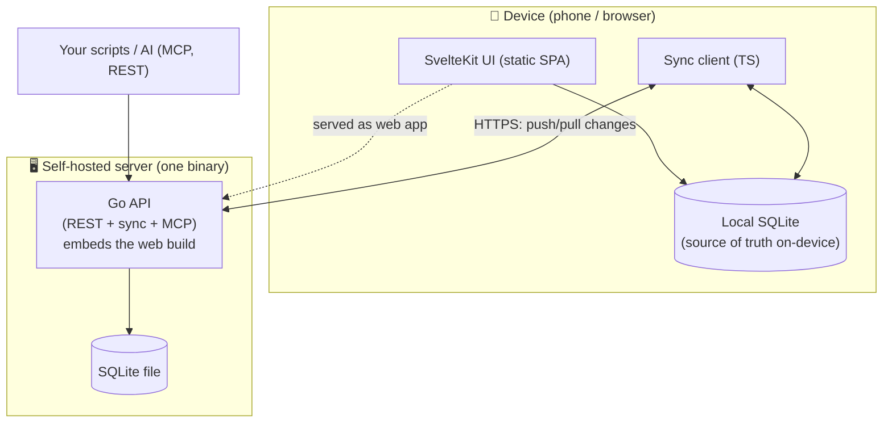

# 02 — Architecture

## Big picture



**The key idea:** the device holds a **full local SQLite copy** and reads/writes it directly — so the
UI is instant and works with the network off. A background **sync client** reconciles the local DB
with the server. The server is "just" durable storage + the sync endpoint + the API.

This is what makes offline-first cheap to reason about: the UI never talks to the network on the hot
path. It talks to local SQLite. Sync is a separate, retryable concern.

## Components

### `apps/api` — Go service
- **REST API** for sync + direct CRUD (also what the web/mobile client and third parties use).
- **Sync engine** — the push/pull endpoint and conflict resolution (see [05](05-sync-and-offline.md)).
- **MCP server** — exposes read (and selected write) tools over the same domain (later phase).
- **Embeds the web build** via Go `embed`, so a self-hoster runs a single binary that serves both the
  API and the web app.
- **Storage:** a **SQLite** file (see [ADR-0004](decisions/0004-sqlite-everywhere.md)).
- **Auth** — issues/validates JWTs (see ADR-0006).

### `apps/mobile` — SvelteKit + Capacitor
- A **SvelteKit app built static** (`adapter-static`, SPA fallback). No SSR/Node server at runtime.
- That single build is consumed two ways:
  1. **Capacitor** wraps it into iOS/Android apps (with native SQLite + notifications plugins).
  2. The **Go binary embeds it** to serve the self-hosted web app / PWA.
- On-device storage = **SQLite** (native via Capacitor on mobile; WASM/OPFS on web).

### `packages/shared` — TypeScript
- The **generated API client** (from the server's OpenAPI spec) — type-safe calls, no hand-written DTOs.
- **Shared domain types** and the **sync client logic**, written once and used by mobile + web (they're
  the same build, but this keeps sync logic isolated and testable).

## The contract: OpenAPI between Go and TS

Backend is Go, frontend is TS, so we don't get shared types for free. We bridge it:

```
Go handlers + annotations  ──►  OpenAPI spec (checked into repo)  ──►  generated TS client (packages/shared)
```

- The **OpenAPI spec is the source of truth** for the wire format.
- CI fails if the spec drifts from the code, and regenerates the TS client.
- Net effect: end-to-end type safety across a Go/TS boundary, without a TS backend.

## Same database engine on both sides

Both the device and the server run **SQLite**, so there's **one SQL dialect** to target across the whole
system. The sync engine reconciles two SQLite databases. This keeps schemas and queries aligned and the
server tiny (no separate database process). See [ADR-0004](decisions/0004-sqlite-everywhere.md) for why,
and how Postgres can be slotted in later as an optional backend.

## Tech stack

| Layer | Choice | Notes |
|---|---|---|
| API language | **Go** | Single static binary; embeds web build. ADR-0001. |
| HTTP framework | std `net/http` + a light router _(tbd)_ | Decide at scaffold (e.g. chi/gin). |
| Storage | **SQLite** | ADR-0004. Pure-Go driver (`modernc.org/sqlite`) keeps the binary CGO-free. |
| Migrations | plain SQL, checked in _(tbd tool)_ | e.g. `goose`/`golang-migrate`. |
| Frontend | **SvelteKit** (`adapter-static`) | One static SPA build. |
| Mobile shell | **Capacitor** | iOS/Android wrappers + native plugins. ADR-0002. |
| Device DB | **SQLite** | `@capacitor-community/sqlite` (native) / wa-sqlite (web). |
| Client pkg mgr | **pnpm** workspaces | Monorepo JS. |
| API contract | **OpenAPI 3** | Generates the TS client. |
| Charts | a lightweight Svelte chart lib _(tbd)_ | Keep it small. |

_"tbd/tentative" items are deliberately deferred to scaffolding; they don't affect the plan._

## Error handling convention

The API returns a typed error envelope `{ error, code, details }` with a correct HTTP status, mapped
from a backend error taxonomy (NotFound→404, Validation→400, AlreadyExists→409, Unauthorized→401,
Forbidden→403, …). No string-matching on error messages for status mapping; **never** leak raw internal
errors to clients. Clients branch on `code`/HTTP status, not message strings. Genuine internal failures
return a generic 500 (cause logged server-side, not returned).

## Why this shape

- **Offline-first** demands a local DB + sync; everything above follows from that.
- **One UI build** for mobile + web kills duplicate frontends.
- **Single Go binary + a SQLite file** is the smallest thing a self-hoster can operate.
- **OpenAPI** keeps the Go/TS split honest.

See the [decision records](decisions/) for the trade-offs behind each pillar.
