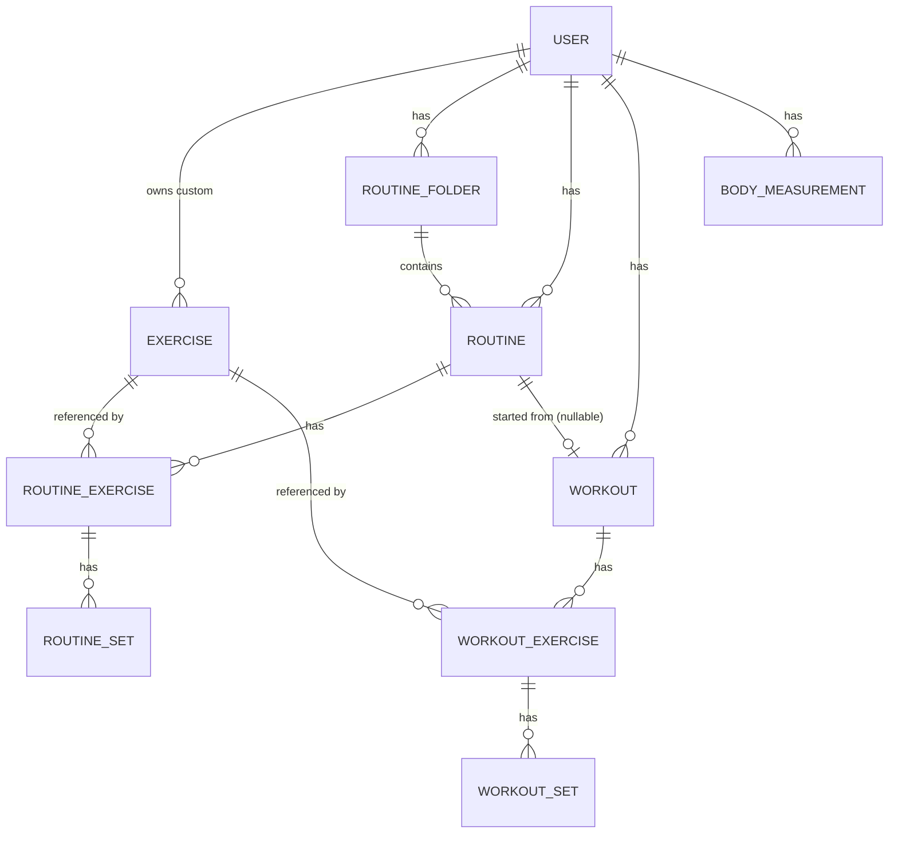

# 03 — Data model

## Design notes

- **Familiar concepts.** The entity set mirrors the concepts common to popular gym loggers (workouts,
  routines, routine folders, exercise templates, body measurements). This keeps the model intuitive and
  makes **import/export with other trackers** straightforward later.
- **The same logical schema exists twice**: in **SQLite on the device** and in **SQLite on the server**.
  Sync reconciles them. One SQL dialect, so the schemas stay aligned.
- **Every syncable row carries sync metadata** (see below). This is what makes offline-first work.

## Sync metadata (on every syncable table)

| Column | Type | Purpose |
|---|---|---|
| `id` | UUID (text) | **Client-generated** (UUIDv7) so a record has a stable id before it ever reaches the server. |
| `user_id` | UUID (text) | Owner. Scopes everything; the server enforces it. |
| `updated_at` | integer (ms epoch, UTC) | Last local modification. Drives last-write-wins + conflict resolution. |
| `deleted_at` | integer, nullable | **Soft delete / tombstone.** Deletes must sync, so we never hard-delete syncable rows. |
| `created_at` | integer | Audit. |

UUIDv7 is time-ordered, which keeps index locality good and gives us a natural sort.

## Entities

### `user`
`id, email (unique), password_hash, display_name, settings (json text), created_at, updated_at`
- `settings`: units (kg/lb), default rest time, first-day-of-week, theme, etc.

### `exercise` (template)
`id, user_id (nullable → built-in), name, exercise_type, primary_muscle, secondary_muscles (json),
equipment, instructions, is_archived, + sync meta`
- `exercise_type`: `weight_reps | reps_only | duration | weight_distance | distance` (start with the
  first three).
- Built-in library rows have `user_id = NULL` and ship as seed data. Custom exercises belong to a user.

### `routine_folder`
`id, user_id, name, order_index, + sync meta`

### `routine`
`id, user_id, folder_id (nullable), title, notes, order_index, + sync meta`

### `routine_exercise`
`id, routine_id, exercise_id, order_index, notes, rest_seconds, superset_group (nullable), + sync meta`

### `routine_set` (planned set)
`id, routine_exercise_id, order_index, set_type, target_weight, target_reps, target_rpe, target_duration,
+ sync meta`
- `set_type`: `normal | warmup | drop | failure`.

### `workout` (a logged session)
`id, user_id, routine_id (nullable), title, notes, start_time, end_time, + sync meta`

### `workout_exercise`
`id, workout_id, exercise_id, order_index, notes, superset_group (nullable), + sync meta`

### `workout_set` (a logged set)
`id, workout_exercise_id, order_index, set_type, weight, reps, rpe, duration, distance, is_completed,
+ sync meta`

### `body_measurement` _(post-MVP)_
`id, user_id, type, value, unit, measured_at, + sync meta`
- `type`: `bodyweight | body_fat | waist | …`.

## Derived data (not stored, or cached)

- **Personal records**, **estimated 1RM**, **per-exercise history**, **volume**: computed on the
  client from `workout_set` rows (the device has the full history locally). The server can expose the
  same as read endpoints / MCP tools, computed on demand or cached.
- A **PR board** and **exercise history** are read views, not new write tables.

## Units

Store canonical units (kg, meters, seconds); convert for display per `user.settings.units`. This
avoids ambiguity in sync and stats. Document the canonical units next to each numeric column at
schema-write time.

## Open questions (resolve at schema implementation)

- Plate/barbell config per exercise (for a plate calculator) — defer.
- Whether `superset_group` is a simple shared integer per exercise vs. a join table — start simple
  (shared small int within a routine/workout).
- Exact `settings` JSON shape — pin down with the mobile screens.
