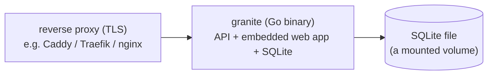

# 07 — Self-hosting

Self-hosting is a first-class goal, not an afterthought. The bar: **`docker-compose up` and one config
file** (or just run the binary).

## What you run

That's the whole system: **one container** (the Go binary, which serves the REST/sync/MCP API **and**
the embedded web app, and stores data in a SQLite file on a mounted volume) behind a reverse proxy for
TLS. No separate database process to run, tune, or back up.

## Image & build

- The Go binary **embeds the SvelteKit static build**, so the image is self-contained — no separate
  web container, no Node at runtime.
- A pure-Go SQLite driver keeps the binary **CGO-free** and easy to cross-compile to a small static image.
- Multi-stage Docker build: build web (pnpm) → build Go (with embedded assets) → tiny final image
  (distroless/alpine).
- Built and published by **GitHub Actions** (public repo → free CI). Images published to a registry
  (e.g. GHCR) so self-hosters can `docker pull`, or build from source.

## Configuration (env vars)

| Var | Purpose |
|---|---|
| `GRANITE_DB_PATH` | Path to the SQLite file (on a mounted volume). |
| `GRANITE_JWT_SECRET` | Signing secret for JWTs. |
| `GRANITE_BASE_URL` | Public URL (links, CORS, etc.). |
| `GRANITE_ALLOW_REGISTRATION` | `true`/`false` or invite-gated — lock down a personal instance. |
| `GRANITE_LOG_LEVEL` | Logging. |
| `PORT` | Listen port (default 8080). |

A `.env.example` + `deploy/docker-compose.yml` will ship with the repo.

## Backups & data ownership

- **Backups** are trivial: snapshot the **single SQLite file** (e.g. a scheduled copy, or use a tool
  like Litestream for continuous replication). No DB dump tooling required.
- **In-app export**: `GET /api/v1/export` returns a complete JSON of your data from day one — true
  "own your data," independent of file-level backups.
- **Restore**: `POST /api/v1/import` reloads an export.

## Security notes

- argon2id password hashing; rotating refresh tokens.
- An instance is single-person/household; registration gated by default on self-hosts.
- Put it behind a reverse proxy with TLS; optionally behind an external identity provider once OIDC lands.
- No telemetry, ever.

## Minimal footprint

A single Go binary + a SQLite file comfortably runs on a Raspberry Pi, a NAS, or a small VPS/LXC. The
heavy read/stat work happens on the **client** (each device has the full local SQLite), so the server
stays light even with the whole history synced.

## Scaling beyond a household (optional, later)

If anyone ever runs a larger shared instance, the storage layer is designed behind an interface so a
**PostgreSQL** backend can be slotted in without touching the app logic (see
[ADR-0004](decisions/0004-sqlite-everywhere.md)). Not needed for the target use case.
